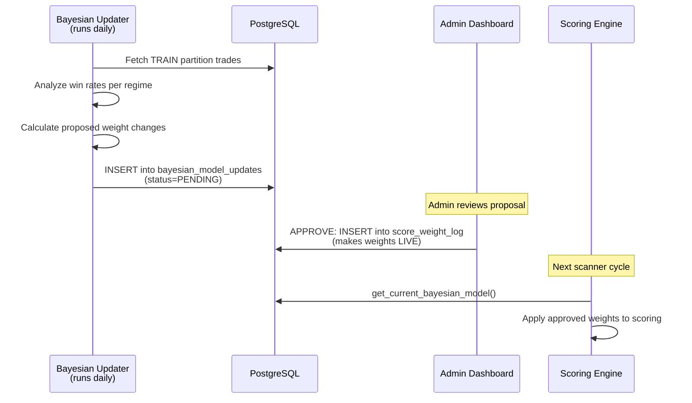

# 🔍 ELITE BREAKOUT SYSTEM — Complete Audit Document

> **Generated**: 2026-06-19 | **Codebase**: 49 files in `/app` | **Database**: PostgreSQL (Railway) | **Deployment**: Railway (Docker)

---

## Table of Contents

1. [Architecture Overview](#1-architecture-overview)
2. [Database Schema (15 Tables)](#2-database-schema-15-tables)
3. [REST API Endpoints (30+)](#3-rest-api-endpoints-30)
4. [Scanner Engines (Brain Logic)](#4-scanner-engines-brain-logic)
5. [Scoring Engine](#5-scoring-engine)
6. [Breakout Detection Engine](#6-breakout-detection-engine)
7. [SL/Target Computation](#7-sltarget-computation)
8. [Technical Indicators](#8-technical-indicators)
9. [Cache Layers (6 Caches)](#9-cache-layers-6-caches)
10. [Bayesian Model Update Workflow](#10-bayesian-model-update-workflow)
11. [Wealth Engine](#11-wealth-engine)
12. [Portfolio & Risk Management](#12-portfolio--risk-management)
13. [Telegram Notification Pipeline](#13-telegram-notification-pipeline)
14. [User & Session Management](#14-user--session-management)
15. [Background Thread Orchestration](#15-background-thread-orchestration)
16. [External Data Sources](#16-external-data-sources)
17. [Configuration Reference](#17-configuration-reference)
18. [File Map](#18-file-map)

---

## 1. Architecture Overview

```mermaid
graph TB
    subgraph "Entry Point"
        MAIN["main.py<br/>Self-Healing Orchestrator"]
    end

    subgraph "Background Threads (9)"
        INTRA["IntradayScanner<br/>15m bars, every 5min"]
        LIVE["LiveScanner<br/>1H bars, every 10min"]
        EOD["EODScanner<br/>Daily bars, 6:30 PM once"]
        REV["ReversalScanner<br/>Daily bars, 6:30 PM once"]
        PERF["PerformanceTracker<br/>Every 5min"]
        SCHED["SystemScheduler<br/>Daily Builder + Wealth"]
        BAYES["BayesianUpdater<br/>Every 24h"]
        AIW["AI Worker<br/>Concall analysis"]
        PLW["Pledge Worker<br/>Promoter pledge scraping"]
    end

    subgraph "Main Thread"
        FLASK["Flask Dashboard Server<br/>Port 8080"]
    end

    subgraph "Data Layer"
        PG["PostgreSQL<br/>15 tables"]
        PARQUET["Parquet Files<br/>Watchlist + Wealth"]
        CACHE["In-Memory Caches<br/>6 cache layers"]
    end

    subgraph "External APIs"
        YF["Yahoo Finance<br/>OHLCV data"]
        TG["Telegram Bot API<br/>Alert delivery"]
        GEMINI["Google Gemini AI<br/>Concall analysis"]
        NSE["NSE India<br/>Delivery + Block deals"]
        TL["Trendlyne<br/>Pledge data"]
    end

    MAIN --> INTRA & LIVE & EOD & REV & PERF & SCHED & BAYES & AIW & PLW
    MAIN --> FLASK
    INTRA & LIVE & EOD & REV --> PG
    INTRA & LIVE & EOD & REV --> TG
    PERF --> PG
    SCHED --> PARQUET
    FLASK --> PG & PARQUET & CACHE
    AIW --> GEMINI
    PLW --> TL
```



### Deployment Model

| Component | Detail |
|-----------|--------|
| **Platform** | Railway (Docker) |
| **Entry Command** | `python app/main.py` (via [start.sh](file:///Users/abhinavmaheshwari/Documents/ELITE_BREAKOUT_SYSTEM/start.sh)) |
| **Main Thread** | Flask dashboard server on PORT 8080 |
| **Background Threads** | 9 daemon threads managed by watchdog |
| **Database** | PostgreSQL (Railway addon, `DATABASE_URL` env var) |
| **Health Check** | `GET /health` returns scanner status JSON |
| **Watchdog** | Auto-restarts crashed threads every 30s (except one-shot scanners) |
| **Process Supervisor** | `start.sh` — restarts entire process on non-zero exit codes |

---

## 2. Database Schema (15 Tables)

### 2.1 `alerts` — Core Trade/Alert Table

> **Source**: [database.py L130-201](file:///Users/abhinavmaheshwari/Documents/ELITE_BREAKOUT_SYSTEM/app/database.py#L130-L201)

| Column | Type | Description |
|--------|------|-------------|
| `id` | SERIAL PK | Auto-increment primary key |
| `symbol` | TEXT NOT NULL | NSE stock symbol (e.g., `RELIANCE`) |
| `breakout_type` | TEXT NOT NULL | Encoded as `signal\|timeframe\|category\|scanner` |
| `alert_time` | TIMESTAMPTZ | When the alert was generated (with timezone) |
| `alert_date` | TEXT | Date part `YYYY-MM-DD` (derived, used for dedup) |
| `scanner` | TEXT | Scanner name: `INTRADAY`, `1H`, `EOD`, `REVERSAL` |
| `category` | TEXT | Fundamental category from daily_builder |
| `entry_price` | REAL | Price at alert time |
| `stop_loss` | REAL | Computed SL price |
| `target_price` | REAL | Primary target (T1) price |
| `signals` | TEXT | Pipe-separated signal names |
| `score` | REAL | Composite score (0–100) |
| `rsi` | REAL | RSI at alert time |
| `volume_ratio` | REAL | Volume vs average ratio |
| `status` | TEXT | `OPEN`, `WIN`, `LOSS` |
| `exit_price` | REAL | Price when position closed |
| `pnl_pct` | REAL | Profit/Loss percentage |
| `pnl_rs` | REAL | Profit/Loss in rupees |
| `closed_at` | TEXT | ISO timestamp when closed |
| `capital_allocated` | REAL | Rupees allocated to this trade |
| `shares_bought` | INTEGER | Number of shares (risk-based sizing) |
| `context` | JSONB | Full diagnostic context (technicals, fundamentals, session, execution) |
| `model_version` | TEXT | Bayesian model version (e.g., `v1`) |
| `bayesian_regime` | TEXT | Market regime: `BULL`, `BEAR`, `SIDEWAYS` |
| `bayesian_weights` | JSONB | Actual scoring weights used |
| `data_partition` | TEXT | `TRAIN` or `TEST` (for backtesting) |
| `seen_by_user` | BOOLEAN | Has user seen this alert in dashboard |
| `seen_by_admin` | BOOLEAN | Has admin seen this alert |
| `created_at` | TIMESTAMPTZ | Row creation time |
| `updated_at` | TIMESTAMPTZ | Last update time |

**Unique Constraint**: `(symbol, breakout_type, alert_date)` — prevents duplicate alerts for the same symbol + signal on the same day.

**Key Indexes**: `idx_alerts_symbol`, `idx_alerts_date`, `idx_alerts_symbol_date`, `idx_alerts_cooldown`

---

### 2.2 `scanner_health` — Scanner Status Monitoring

> **Source**: [database.py L252-273](file:///Users/abhinavmaheshwari/Documents/ELITE_BREAKOUT_SYSTEM/app/database.py#L252-L273)

| Column | Type | Description |
|--------|------|-------------|
| `scanner_name` | TEXT PK | `INTRADAY`, `1H`, `EOD`, `REVERSAL`, `Wealth Engine`, `DAILY_BUILDER` |
| `status` | TEXT | `OK`, `DOWN`, `IDLE` |
| `last_success` | TEXT | ISO timestamp of last successful scan |
| `today_alerts` | INTEGER | Number of alerts fired today |
| `error_msg` | TEXT | Error message when `status=DOWN` |
| `is_acknowledged` | BOOLEAN | Admin dismissed the error |
| `error_severity` | TEXT | `CRITICAL` or `IGNORABLE` (auto-classified) |
| `error_count` | INTEGER | Consecutive error count |
| `first_error_at` | TEXT | When errors started |
| `retry_count` | INTEGER | Current retry attempt |
| `scheduled_for` | TEXT | Human-readable schedule (e.g., `06:30 IST`) |
| `updated_at` | TEXT | Last update timestamp |

**Auto-Recovery Logic**: When `status='OK'`, error fields are automatically cleared and `is_acknowledged=TRUE`.

---

### 2.3 `score_weight_log` — Bayesian Weight Versioning

> **Source**: [database.py L205-226](file:///Users/abhinavmaheshwari/Documents/ELITE_BREAKOUT_SYSTEM/app/database.py#L205-L226)

| Column | Type | Description |
|--------|------|-------------|
| `id` | SERIAL PK | Auto-increment |
| `model_version` | TEXT | Version string (`v1`, `v2`, ...) |
| `regime` | TEXT | `BULL`, `BEAR`, `SIDEWAYS` |
| `weights` | JSONB | Weight dictionary (must contain `volume_breakout`, `rsi_divergence`, `ema_crossover`) |
| `created_at` | TEXT | When this version was activated |

**CHECK constraint**: `chk_weights_json` ensures required keys exist in JSONB.

---

### 2.4 `bayesian_model_updates` — Pending Admin Approval Queue

> **Source**: [database.py L228-249](file:///Users/abhinavmaheshwari/Documents/ELITE_BREAKOUT_SYSTEM/app/database.py#L228-L249)

| Column | Type | Description |
|--------|------|-------------|
| `id` | SERIAL PK | Auto-increment |
| `regime` | TEXT | Target regime |
| `proposed_version` | TEXT | New version string |
| `current_version` | TEXT | Currently active version |
| `current_weights` | JSONB | Current live weights |
| `proposed_weights` | JSONB | New proposed weights |
| `trades_analyzed` | INTEGER | Number of TRAIN trades used |
| `win_rate` | REAL | Win rate from analysis |
| `reason` | TEXT | Why weights changed |
| `status` | TEXT | `PENDING`, `APPROVED`, `REJECTED` |
| `admin_comment` | TEXT | Admin's review comment |
| `approved_by` | TEXT | Admin who approved/rejected |
| `approved_at` / `rejected_at` / `applied_at` | TEXT | Timestamps |
| `created_at` | TEXT | Submission timestamp |
| `expires_at` | TEXT | Optional expiry |

---

### 2.5 `system_state` — Key-Value Configuration Store

| Column | Type | Description |
|--------|------|-------------|
| `key` | TEXT PK | State key (e.g., `performance_data`, `sector_rotation`) |
| `value` | TEXT | JSON-encoded value |

**Used by**: Performance tracker stores `performance_data.json` contents here as backup.

---

### 2.6 `ai_concall_cache_v3` — AI Concall Analysis Cache

| Column | Type | Description |
|--------|------|-------------|
| `id` | SERIAL PK | Auto-increment |
| `symbol` | TEXT | Stock symbol |
| `pdf_url` | TEXT UNIQUE | Source PDF URL (dedup key) |
| `analysis_data` | JSONB | Gemini AI analysis results |
| `created_at` | TEXT | When analysis was cached |

---

### 2.7 `promoter_pledge_cache` — Promoter Pledge Data

| Column | Type | Description |
|--------|------|-------------|
| `symbol` | TEXT PK | Stock symbol |
| `pledge_pct` | REAL | Percentage of shares pledged |
| `updated_at` | TIMESTAMPTZ | Last update time |

---

### 2.8 `fetch_errors` — Data Fetch Error Aggregation

| Column | Type | Description |
|--------|------|-------------|
| `id` | SERIAL PK | Auto-increment |
| `source_name` | TEXT | Data source (e.g., `yfinance`) |
| `scanner_name` | TEXT | Which scanner encountered the error |
| `symbol` | TEXT | Affected stock |
| `interval` | TEXT | Timeframe (`15m`, `1h`, `1d`) |
| `category` | TEXT | Error category |
| `occurrences` | INTEGER | How many times this error occurred |
| `first_seen` / `last_seen` | TEXT | Timestamps |
| `last_error_msg` | TEXT | Most recent error message |
| `is_acknowledged` | BOOLEAN | Admin dismissed |

**Unique Index**: `(source_name, scanner_name, symbol, interval, category)` — for upsert deduplication.

---

### 2.9 `data_cache_metadata` — Cache Freshness Tracking

| Column | Type | Description |
|--------|------|-------------|
| `key` | TEXT PK | Cache key identifier |
| `last_fetched` | TEXT | When data was last fetched |
| `cadence_seconds` | INTEGER | Expected refresh interval |
| `rows` | INTEGER | Number of rows in cached data |
| `etag` | TEXT | HTTP ETag for conditional requests |
| `source` | TEXT | Data source name |
| `updated_at` | TEXT | Last metadata update |

---

### 2.10 `data_fetch_health` — External API Health Monitoring

| Column | Type | Description |
|--------|------|-------------|
| `source_name` | TEXT PK | External API identifier |
| `last_success` / `last_failure` | TEXT | Timestamps |
| `consecutive_failures` | INTEGER | Failure count (resets on success) |
| `error_msg` | TEXT | Last error message |
| `is_acknowledged` | BOOLEAN | Admin dismissed |
| `updated_at` | TEXT | Last update |

---

### 2.11 `manual_portfolio` — User's Manual Portfolio Tracker

| Column | Type | Description |
|--------|------|-------------|
| `id` | SERIAL PK | Auto-increment |
| `symbol` | TEXT | Stock symbol |
| `entry_date` | DATE | When bought |
| `entry_price` | REAL | Purchase price |
| `quantity` | INTEGER | Number of shares |
| `added_at` | TIMESTAMPTZ | When entry was added |

---

### 2.12 `parquet_cache` — Binary Parquet File Storage

| Column | Type | Description |
|--------|------|-------------|
| `name` | TEXT | File identifier (e.g., `daily_builder`, `wealth_engine`) |
| `date` | TEXT | Date of the cached file |
| `data` | BYTEA | Raw binary parquet data |

**PK**: `(name, date)` — stores daily snapshots of parquet files in Postgres for cross-deploy persistence.

---

### 2.13 `telegram_queue` — Async Alert Delivery Queue

| Column | Type | Description |
|--------|------|-------------|
| `id` | SERIAL PK | Auto-increment |
| `alert_id` | INTEGER FK→alerts(id) | Related alert |
| `symbol` | TEXT | Stock symbol |
| `message_text` | TEXT | Full formatted Telegram message |
| `status` | TEXT | `pending`, `sent` |
| `retry_count` | INTEGER | Failed send attempts (max 3) |
| `created_at` / `sent_at` | TEXT | Timestamps |

---

### 2.14 `wealth_buy_alert` — Wealth Engine Buy Signals

| Column | Type | Description |
|--------|------|-------------|
| `id` | SERIAL PK | Auto-increment |
| `symbol` | TEXT | Stock symbol |
| `alert_price` | REAL | Price at buy signal |
| `alert_date` / `alert_time` | TEXT | When signal was generated |
| `breakout_type` | TEXT | Signal type |
| `fm_score` | REAL | Fundamental + technical composite score |
| `status` | TEXT | `ACTIVE`, `CLOSED` |
| `current_price` / `current_score` | REAL | Real-time tracking |
| `entry_signal` / `exit_signal` | TEXT | Signal descriptions |
| `exit_price` / `exit_date` / `exit_time` | Various | When position was closed |
| `is_closed` | BOOLEAN | Position lifecycle flag |
| `pnl_rs` / `pnl_pct` | REAL | P&L tracking |
| `position_pct` / `position_amount` / `position_shares` | Various | Position sizing |
| `portfolio_bucket` | TEXT | `CORE`, `TACTICAL`, `SPECULATIVE`, etc. |
| `valuation_score` | REAL | Valuation component score |
| `updated_at` | TIMESTAMPTZ | Last update |

**Unique Constraint**: `uq_wealth_symbol_date_type` on `(symbol, alert_date, breakout_type)`

---

### 2.15 `users` / `user_sessions` / `user_messages` — User Management

#### `users`
| Column | Type | Description |
|--------|------|-------------|
| `user_id` | SERIAL PK | Auto-increment |
| `name` | TEXT UNIQUE | Username |
| `role` | TEXT | `USER` or `ADMIN` |
| `created_at` | TEXT | Registration time |

#### `user_sessions`
| Column | Type | Description |
|--------|------|-------------|
| `id` | SERIAL PK | Auto-increment |
| `user_id` | INTEGER FK→users | Session owner |
| `ip_address` | TEXT | Client IP |
| `login_time` / `logoff_time` | TEXT | Session bounds |
| `is_online` | BOOLEAN | Active status (stale after 120s without ping) |

#### `user_messages`
| Column | Type | Description |
|--------|------|-------------|
| `id` | SERIAL PK | Auto-increment |
| `user_id` | INTEGER FK→users | Message recipient |
| `is_from_admin` | BOOLEAN | Direction flag |
| `message` | TEXT | Message content |
| `created_at` | TEXT | Timestamp |
| `is_read` | BOOLEAN | Read receipt |

### Database Views

#### `v_trade_analytics` — Flattened Analytics View

> **Source**: [database.py L332-371](file:///Users/abhinavmaheshwari/Documents/ELITE_BREAKOUT_SYSTEM/app/database.py#L332-L371)

Flattens the `context` JSONB column into queryable columns:
- **Technicals**: `above_ema20`, `above_sma50`, `golden_cross`, `body_ratio`, `delivery_pct`, `rsi`, `volume_ratio`
- **Session**: `session_open`, `session_day_high`, `session_day_low`
- **Fundamentals**: `peg`, `yoy_rev`, `yoy_profit`, `roe`
- **Execution**: `sl_method`, `t_method`, `trail_note`

---

## 3. REST API Endpoints (30+)

> **Source**: [dashboard_server.py](file:///Users/abhinavmaheshwari/Documents/ELITE_BREAKOUT_SYSTEM/app/dashboard_server.py)

### 3.1 Dashboard Pages

| Method | Route | Handler | Description |
|--------|-------|---------|-------------|
| GET | `/` | `index()` | User dashboard HTML page |
| GET | `/admin` | `admin_index()` | Admin dashboard HTML page |
| GET | `/wealth` | `route_wealth()` | Wealth dashboard HTML page |
| GET | `/health` | `health()` | Health check (JSON: scanner statuses, uptime) |

### 3.2 Core Data APIs

| Method | Route | Handler | Description |
|--------|-------|---------|-------------|
| GET | `/data/performance_data.json` | `performance_json()` | Full trade history with summary stats. Returns `{trades: [...], summary: {...}, scanner_stats: {...}, generated_at: ...}` |
| GET | `/api/summary` | `api_summary()` | Condensed summary: win_rate, winners, losers, open_positions |
| GET | `/api/shortlist` | `api_shortlist()` | Today's fundamental watchlist (from parquet) |
| GET | `/api/download_shortlist` | `api_download_shortlist()` | Download watchlist as CSV file |

### 3.3 Scanner Status APIs

| Method | Route | Handler | Description |
|--------|-------|---------|-------------|
| GET | `/api/scanner_status` | `api_scanner_status()` | Live scanner health from DB. Returns `{scanner_name: {status, last_success, today_alerts, error_msg, ...}}` |
| POST | `/api/scanner_health/acknowledge/<name>` | `api_acknowledge_scanner_health()` | Admin: dismiss scanner error |

### 3.4 Alert Management APIs

| Method | Route | Handler | Description |
|--------|-------|---------|-------------|
| GET | `/api/todays_alerts` | `api_todays_alerts()` | Today's alerts with `seen_by_user`/`seen_by_admin` flags |
| POST | `/api/alert/mark_seen` | `api_mark_alert_seen()` | Mark alert as seen. Body: `{alert_id, role}` |

### 3.5 Error Monitoring APIs

| Method | Route | Handler | Description |
|--------|-------|---------|-------------|
| GET | `/api/fetch_errors` | `api_fetch_errors()` | All non-acknowledged fetch errors |
| GET | `/api/fetch_errors/by_scanner?scanner=X` | `api_fetch_errors_by_scanner()` | Errors for specific scanner |
| POST | `/api/fetch_errors/ack/<id>` | `api_ack_fetch_error()` | Acknowledge (dismiss) a fetch error |
| GET | `/api/data_fetch_health` | `api_data_fetch_health()` | External API health status |
| POST | `/api/data_fetch_health/acknowledge/<name>` | `api_acknowledge_health()` | Dismiss data source error |

### 3.6 Portfolio APIs

| Method | Route | Handler | Description |
|--------|-------|---------|-------------|
| GET | `/api/portfolio` | `api_get_portfolio()` | Manual portfolio with live prices, P&L |
| POST | `/api/portfolio/add` | `api_add_portfolio()` | Add stock. Body: `{symbol, entry_date, entry_price, quantity}` |
| POST | `/api/portfolio/remove` | `api_remove_portfolio()` | Remove entry. Body: `{id}` |

### 3.7 Wealth Engine APIs

| Method | Route | Handler | Description |
|--------|-------|---------|-------------|
| GET | `/api/wealth` | `api_wealth()` | Wealth dashboard data (from parquet) |
| GET | `/api/macro_state` | `api_macro_state()` | Nifty macro state: 6M return, distance from 52W high |
| GET | `/api/wealth/alerts` | `get_wealth_alerts()` | Wealth buy alerts (last N days) |
| POST | `/api/wealth/save-alert` | `save_wealth_alert()` | Save manual wealth buy alert |
| POST | `/api/wealth/update-alert/<id>` | `update_wealth_alert()` | Update alert status |
| GET | `/api/wealth/open-positions` | `get_open_positions_api()` | All open wealth positions |
| GET | `/api/wealth/closed-positions` | `get_closed_positions_api()` | Closed positions (last 30 days) |
| POST | `/api/wealth/close-position` | `close_position_api()` | Close a position manually |

### 3.8 Market Data APIs

| Method | Route | Handler | Description |
|--------|-------|---------|-------------|
| GET | `/api/indices` | `api_indices()` | Live Nifty/Sensex/BankNifty prices + % change |
| GET | `/api/all_tickers` | `api_all_tickers()` | All symbols from watchlist (autocomplete data) |
| GET | `/api/news/<symbol>` | `api_news()` | Recent news for a stock (Google News RSS) |
| GET | `/api/notices/<symbol>` | `api_notices()` | NSE exchange notices for a stock |

### 3.9 AI & Analysis APIs

| Method | Route | Handler | Description |
|--------|-------|---------|-------------|
| GET | `/api/concall_ai/<symbol>` | `api_concall_ai()` | AI concall analysis (cached or live via Gemini) |

### 3.10 User & Messaging APIs

| Method | Route | Handler | Description |
|--------|-------|---------|-------------|
| POST/GET | `/api/viewers` | `api_viewers()` | POST: ping session. GET: active viewers list |
| GET/POST | `/api/messages` | `api_messages()` | GET: fetch messages for user. POST: send message |
| POST | `/api/messages/read` | `api_messages_read()` | Mark messages as read |

### 3.11 Admin Export APIs

| Method | Route | Handler | Description |
|--------|-------|---------|-------------|
| GET | `/admin/export/<table>` | `export_csv_data()` | Export any DB table as CSV download |
| GET | `/admin/export/watchlist/<type>` | `export_watchlist()` | Export watchlist/excluded as CSV |

---

## 4. Scanner Engines (Brain Logic)

### 4.1 Intraday Scanner (15-minute)

> **Source**: [intraday.py](file:///Users/abhinavmaheshwari/Documents/ELITE_BREAKOUT_SYSTEM/app/intraday.py) | 34KB

| Property | Value |
|----------|-------|
| **Timeframe** | 15-minute candles |
| **Schedule** | Continuous loop 9:32 AM – 3:30 PM IST (weekdays) |
| **Scan Interval** | Every ~5 minutes |
| **Data Source** | Yahoo Finance via `price_cache.py` (10d, 15m interval) |
| **Watchlist** | From `watchlist_cache.py` (fundamental-filtered universe) |

**Pipeline**:
1. Load watchlist → Fetch 15m OHLCV data (batched, cached)
2. Apply `technical_indicators.py` → Compute RSI, EMA, SMA, MACD, Bollinger, ADX, pivots, swing points
3. Run `breakout_engine.detect_breakouts()` → Detect windowed breakouts + BB squeeze + volume surge
4. Apply `scoring_engine.check_hard_disqualifiers()` → Filter out penny stocks, low volume, bad candle quality
5. Run `scoring_engine.calculate_score()` → Composite 0–100 score with Bayesian weights
6. Apply score threshold (15m: ≥78) → Only high-conviction alerts pass
7. Compute SL/Target via `sl_target_helper.compute_sl_and_target(mode="INTRADAY")`
8. Check deduplication via `database.check_recent_alert()` (cooldown window)
9. Save to DB via `database.save_alert_if_new()` → Portfolio allocation computed
10. Format message via `message_formatter.format_alert()` → Send via Telegram (queued)

**Hard Disqualifiers** (instant rejection):
- Stock price < ₹100
- Volume < 150,000 (15m average)
- Volume ratio < 2.5x average
- Body ratio < 60% (wick-dominated candle)
- Close position < 70% of candle range
- Upper wick > 20% of range
- RSI < 52 or RSI > 87
- Minimum 2 breakout signals required

---

### 4.2 Live Scanner (1-Hour)

> **Source**: [live_scanner.py](file:///Users/abhinavmaheshwari/Documents/ELITE_BREAKOUT_SYSTEM/app/live_scanner.py) | 31KB

| Property | Value |
|----------|-------|
| **Timeframe** | 1-hour candles |
| **Schedule** | Continuous loop 10:17 AM – 3:30 PM IST (weekdays) |
| **Scan Interval** | Every ~10 minutes |
| **Data Source** | Yahoo Finance (30d, 1h interval) |
| **Score Threshold** | ≥ 80 |

**Pipeline**: Same as Intraday but with 1H-specific parameters:
- Volume ratio ≥ 2.0x, Volume average ≥ 100,000
- Body ratio ≥ 55%, Close position ≥ 65%
- Upper wick ≤ 25%, RSI 55–86
- Minimum 3 breakout signals required
- SL/Target mode: `LIVE_1H`

---

### 4.3 EOD Scanner (Daily)

> **Source**: [eod_scanner.py](file:///Users/abhinavmaheshwari/Documents/ELITE_BREAKOUT_SYSTEM/app/eod_scanner.py) | 25KB

| Property | Value |
|----------|-------|
| **Timeframe** | Daily candles |
| **Schedule** | Once at 6:30 PM IST (weekdays) |
| **Data Source** | Yahoo Finance (6mo, 1d interval) |
| **Score Threshold** | ≥ 82 |

**Pipeline**: Same core pipeline with daily parameters:
- Volume ratio ≥ 1.8x, Volume average ≥ 50,000
- Body ratio ≥ 45%, Close position ≥ 65%
- Upper wick ≤ 35%, RSI 55–88
- Minimum 1 breakout signal required
- SL/Target mode: `EOD`

**Retry Logic**: On failure, retries with exponential backoff until midnight, then force-stops.

---

### 4.4 Reversal Scanner (Mean Reversion)

> **Source**: [reversal_scanner.py](file:///Users/abhinavmaheshwari/Documents/ELITE_BREAKOUT_SYSTEM/app/reversal_scanner.py) | 24KB

| Property | Value |
|----------|-------|
| **Timeframe** | Daily candles |
| **Schedule** | Once at 6:30 PM IST (weekdays) |
| **Data Source** | Yahoo Finance (6mo, 1d interval) |
| **Strategy** | Counter-trend oversold bounce (long-only) |

**Unique Logic** (vs breakout scanners):
- Looks for stocks **down 18–60%** from 52-week highs
- **Entry Conditions**: RSI curled up from oversold, MACD turning positive, close > EMA20
- **Scoring**: Custom `_score_reversal()` function (not the standard breakout scoring engine)
- **Targets**: Mean reversion to EMA20/SMA50 (not resistance-based)
- SL/Target mode: `REVERSAL`

---

## 5. Scoring Engine

> **Source**: [scoring_engine.py](file:///Users/abhinavmaheshwari/Documents/ELITE_BREAKOUT_SYSTEM/app/scoring_engine.py) | 47KB

### 5.1 Score Composition

The `calculate_score()` function produces a 0–100 composite score from weighted signal categories:

```
Final Score = Σ (signal_weight × signal_value) + bonus_modifiers - penalty_modifiers
```

### 5.2 Hard Disqualifiers (`check_hard_disqualifiers()`)

These cause **instant rejection** (score = 0, alert not generated):

| Check | 15m | 1H | EOD |
|-------|-----|-----|-----|
| Min Stock Price | ₹100 | ₹100 | ₹100 |
| Min Volume Average | 150,000 | 100,000 | 50,000 |
| Min Volume Ratio | 2.5x | 2.0x | 1.8x |
| Min Body Ratio | 60% | 55% | 45% |
| Min Close Position | 70% | 65% | 65% |
| Max Upper Wick | 20% | 25% | 35% |
| RSI Range | 52–87 | 55–86 | 55–88 |
| Min Signals | 2 | 3 | 1 |

### 5.3 Bonus Modifiers (`bonus_modifiers()`)

| Modifier | Bonus | Condition |
|----------|-------|-----------|
| ADX Trending | +3 to +5 | ADX > 25 |
| Golden Cross | +4 | EMA20 crossed above SMA50 |
| EMA Alignment | +3 | Close > EMA20 > SMA50 |
| Delivery Conviction | +2 to +5 | High delivery % (institutional buying) |
| Sector Rotation | +2 to +5 | Stock in a strong-rotating sector |
| Block Deal (FII) | +3 | FII/DII block deal detected today |
| Piotroski Score | +2 to +4 | High Piotroski F-Score (fundamental quality) |
| Tight Base (VCP) | +3 | Volatility Contraction Pattern detected |
| AI Sentiment | +2 to +4 | Positive AI concall sentiment (if enabled) |

---

## 6. Breakout Detection Engine

> **Source**: [breakout_engine.py](file:///Users/abhinavmaheshwari/Documents/ELITE_BREAKOUT_SYSTEM/app/breakout_engine.py)

### 6.1 Windowed Breakout Detection

| Signal Name | Lookback (1d) | Lookback (1h) | Lookback (15m) | Weight |
|-------------|---------------|---------------|----------------|--------|
| 52W Breakout | 252 bars | — | — | 3.0x |
| Monthly Breakout | 100 bars | 260 bars | — | 2.0x |
| Weekly Breakout | 50 bars | 130 bars | 104 bars | 1.2x |
| Daily Breakout | 20 bars | 26 bars | 52 bars | 0.6x |
| Hourly Breakout | — | 6 bars | — | 0.5x |
| Session Breakout | — | — | 25 bars | 0.4x |
| BB Breakout | Independent | Independent | Independent | 1.2x |
| Volume Surge | Independent | Independent | Independent | 1.3x |

### 6.2 Anti-Fake-Breakout Quality Gates

Every breakout must pass **ALL THREE** conditions:

1. **Closing-Price Confirmation**: `close > prev_high` (not just wick touch)
2. **Minimum Breakout Margin**: `close > prev_high × (1 + margin)` — 15m: 0.3%, 1h: 0.5%, 1d: 0.7%
3. **Volume Confirmation**: Breakout candle volume Z-score ≥ 2.5 (vs 20-bar average)

### 6.3 Quality Multipliers

| Multiplier | Value | Condition |
|------------|-------|-----------|
| Tight Base Bonus | 1.5x | VCP tightening + BASE_WIDTH < 1.5% |
| OBV Divergence Penalty | 0.5x | OBV trend bearish during breakout |

### 6.4 Signal Hierarchy Pruning

Higher-level breakouts suppress lower-level redundant signals:
- 52W Breakout → removes Monthly + Weekly + Daily
- Monthly Breakout → removes Weekly + Daily
- BB Breakout and Volume Surge are **never pruned** (independent signals)

---

## 7. SL/Target Computation

> **Source**: [sl_target_helper.py](file:///Users/abhinavmaheshwari/Documents/ELITE_BREAKOUT_SYSTEM/app/sl_target_helper.py) | 33KB

### 7.1 Mode-Specific Parameters

| Parameter | INTRADAY | LIVE_1H | EOD | REVERSAL |
|-----------|----------|---------|-----|----------|
| ATR Base | 1.0 | 1.5 | 2.0 | 2.0 |
| SL ATR Buffer | 0.50 | 0.50 | 0.75 | 1.00 |
| SL % Buffer | 0.30% | 0.50% | 0.75% | 1.00% |
| Min R:R | 1.5:1 | 2.0:1 | 2.0:1 | 2.0:1 |
| Max SL ATR | 2.5 | 2.5 | 3.0 | 3.5 |
| Max Target ATR | 5.0 | 8.0 | 12.0 | 12.0 |

### 7.2 SL Placement Logic

**Priority cascade** (highest to lowest):
1. **VWAP-Anchored** (Intraday/1H only): If VWAP is between candle_low and entry → SL below VWAP
2. **Pivot Swing Low**: True pivot-detected swing low
3. **Pivot S1**: Classical pivot support 1
4. **Rolling Swing Low**: Rolling window minimum
5. **Pivot S2**: Classical pivot support 2
6. **ATR Fallback**: `entry - scaled_mult × ATR`

**Anti-Operator-Trap Buffer**: SL is placed **BELOW** the support zone by `max(sl_atr_buf × ATR, sl_pct_buf × price)`.

**ADX-Aware Widening**: ADX > 35 → 20% wider buffer; ADX > 40 → 30% wider.

### 7.3 Target Placement Logic

**Breakout Scanners** (INTRADAY, 1H, EOD):
- T1: Nearest resistance (pivot swing high → R1 → BB Upper → rolling high → R2)
- T2: R2 or scaled RR (not if overbought)
- T3: 5×RR on MACD+ADX confluence (EOD only)

**Reversal Scanner**:
- T1: BB Mid (Bollinger mean reversion) → SMA50 → R1 → min 2:1 RR
- T2: SMA50 (if not T1) or R1 or 3.5×RR
- T3: R2 on strong MACD momentum

---

## 8. Technical Indicators

> **Source**: [technical_indicators.py](file:///Users/abhinavmaheshwari/Documents/ELITE_BREAKOUT_SYSTEM/app/technical_indicators.py) | 14KB

All indicators are computed and added as columns to the OHLCV DataFrame:

| Indicator | Column(s) | Computation |
|-----------|-----------|-------------|
| RSI | `RSI` | 14-period Relative Strength Index |
| EMA 20 | `EMA20` | 20-period Exponential Moving Average |
| SMA 50 | `SMA50` | 50-period Simple Moving Average |
| MACD | `MACD`, `MACD_SIGNAL`, `MACD_HIST` | 12/26/9 MACD |
| Bollinger Bands | `BB_UPPER`, `BB_LOWER`, `BB_MID` | 20-period, 2 std dev |
| ADX | `ADX` | 14-period Average Directional Index |
| ATR | `ATR` | 14-period Average True Range |
| ATR % | `ATR_PCT` | ATR as percentage of close |
| OBV Trend | `OBV_TREND` | On-Balance Volume trend (+1, 0, -1) |
| Base Width | `BASE_WIDTH` | Consolidation range as % of price |
| VCP Tightening | `VCP_TIGHTENING` | Volatility Contraction Pattern flag |
| Volume Ratio | `VOLUME_RATIO` | Current volume / 20-bar average |
| Body Ratio | `BODY_RATIO` | |close - open| / (high - low) |
| Close Position | `CLOSE_POSITION` | (close - low) / (high - low) |
| Candle Range | `CANDLE_RANGE` | high - low |
| Swing Highs/Lows | `SWING_HIGH`, `SWING_LOW` | Pivot-based swing detection |
| Pivots | `S1`, `S2`, `R1`, `R2` | Classical pivot points |
| Golden Cross | `GOLDEN_CROSS` | EMA20 > SMA50 crossover |
| VWAP | `VWAP` | Volume-Weighted Average Price |

---

## 9. Cache Layers (6 Caches)

### 9.1 Price Cache (In-Memory, TTL-based)

> **Source**: [price_cache.py](file:///Users/abhinavmaheshwari/Documents/ELITE_BREAKOUT_SYSTEM/app/price_cache.py)

| Property | Value |
|----------|-------|
| **Type** | Thread-safe in-memory dict with timestamps |
| **Key** | `(interval, period)` tuple |
| **TTL** | 1m: 30s, 15m: 300s, 1h: 600s, 1d: 1800s |
| **Staleness Check** | During market hours, also checks if data timestamp is > 120s old |
| **Fallback** | Batch download → single-ticker fallback on batch failure |

### 9.2 Watchlist Cache (In-Memory, Date-based)

> **Source**: [watchlist_cache.py](file:///Users/abhinavmaheshwari/Documents/ELITE_BREAKOUT_SYSTEM/app/watchlist_cache.py)

| Property | Value |
|----------|-------|
| **Type** | Module-level global variable |
| **Key** | Current IST date |
| **Invalidation** | New date → reload from parquet file |
| **Fallback Chain** | Parquet file → Postgres `parquet_cache` → Full rebuild via `daily_builder` |

### 9.3 Fundamentals Cache (In-Memory, Tiered TTL)

> **Source**: [fundamentals_cache.py](file:///Users/abhinavmaheshwari/Documents/ELITE_BREAKOUT_SYSTEM/app/fundamentals_cache.py)

| Tier | Market Cap | TTL |
|------|------------|-----|
| Large Cap | > ₹50,000 Cr | 7 days |
| Mid Cap | ₹5,000–50,000 Cr | 3 days |
| Small Cap | < ₹5,000 Cr | 1 day |

Stores **Piotroski F-Score** (0–9) for each stock.

### 9.4 AI Concall Cache (Postgres, 60-day TTL)

> **Source**: `ai_concall_cache_v3` table

Caches Gemini AI analysis of earnings call transcripts. Keyed by `pdf_url` (unique per transcript). Max age: 60 days.

### 9.5 Promoter Pledge Cache (Postgres)

> **Source**: `promoter_pledge_cache` table

Caches promoter pledge percentage scraped from Trendlyne. Updated by the Pledge Worker background thread.

### 9.6 Sector Rotation Cache (In-Memory, 4-hour TTL)

> **Source**: [sector_rotation.py](file:///Users/abhinavmaheshwari/Documents/ELITE_BREAKOUT_SYSTEM/app/sector_rotation.py)

Caches sector relative strength scores and rotation quadrants. Refreshed every 4 hours during market hours. Tracks 20+ Nifty sectoral indices.

---

## 10. Bayesian Model Update Workflow

> **Source**: [bayesian_updater.py](file:///Users/abhinavmaheshwari/Documents/ELITE_BREAKOUT_SYSTEM/app/bayesian_updater.py)



**Key Safety Rules**:
1. Only **one PENDING** update per regime allowed at a time
2. Weights are **NEVER** used until admin explicitly approves
3. `score_weight_log` is the **single source of truth** for active weights
4. `bayesian_model_updates` is the audit trail with full before/after weights
5. **TRAIN/TEST split**: Alerts are randomly partitioned — Bayesian updates only use TRAIN data

---

## 11. Wealth Engine

> **Source**: [wealth_engine.py](file:///Users/abhinavmaheshwari/Documents/ELITE_BREAKOUT_SYSTEM/app/wealth_engine.py) | 38KB

### 11.1 Purpose

Long-term investment engine (hold weeks to months). Fundamentally-driven with technical confirmation.

### 11.2 Scoring Components

The Wealth Engine uses a **100-point composite score** with these components:

| Component | Max Points | Source |
|-----------|------------|--------|
| **Fundamental Score** | 40 | From daily_builder (growth, profitability, quality) |
| **Valuation Score** | 30 | PEG, P/E relative to sector, DCF-implied value |
| **Technical Score** | 30 | Trend alignment, momentum, sector rotation |

### 11.3 Portfolio Buckets

| Bucket | Criteria | Position Size |
|--------|----------|---------------|
| **CORE** | FM Score ≥ 80, strong fundamentals | Largest allocation |
| **TACTICAL** | FM Score 60–80, growth/momentum | Medium allocation |
| **SPECULATIVE** | FM Score < 60, turnaround/event-driven | Smallest allocation |

### 11.4 Position Sizing

```python
def position_size_calculator(fm_score, portfolio_bucket, portfolio_total=10_000_000):
```

Uses Kelly Criterion-inspired sizing based on score and bucket.

### 11.5 Hold Score & Exit Logic

| Factor | Points | Description |
|--------|--------|-------------|
| Fundamental Quality | +0 to +30 | Still meeting growth/profitability criteria |
| Technical Trend | +0 to +20 | Above key MAs, bullish momentum |
| Valuation Discount | +0 to +20 | Still undervalued vs sector peers |
| Tax Optimization | +0 to +10 | LTCG bonus if held > 1 year |
| Risk Flags | -10 to -30 | Pledge increase, sector weakness, earnings miss |

### 11.6 Schedule

| Time | Action |
|------|--------|
| 1:00 AM | Daily Builder rebuilds fundamental watchlist |
| 1:30 AM | Wealth Engine initial run with fresh watchlist |
| 9:15 AM – 3:30 PM | Every 5 minutes during market hours (live signals) |

---

## 12. Portfolio & Risk Management

> **Source**: [portfolio_engine.py](file:///Users/abhinavmaheshwari/Documents/ELITE_BREAKOUT_SYSTEM/app/portfolio_engine.py)

### 12.1 Risk Parameters

| Parameter | Value | Description |
|-----------|-------|-------------|
| `BASE_CAPITAL` | ₹5,00,000 | Starting paper portfolio |
| `RISK_PERCENT` | 1% | Max equity risked per trade |
| `MAX_POSITION_PCT` | 15% | Max capital in single trade |
| **Score ≥ 90 bonus** | 2x risk budget | High-conviction doubling |

### 12.2 Position Sizing Formula

```
per_trade_risk = total_equity × RISK_PERCENT
shares = floor(per_trade_risk / per_share_risk)
per_share_risk = |entry_price - stop_loss|
capital_allocated = shares × entry_price
```

**Caps**: `min(risk-based, 15% of equity, available cash)`

### 12.3 Portfolio State Tracking

```python
total_equity = BASE_CAPITAL + Σ(realized PnL)
deployed_margin = Σ(capital_allocated for OPEN trades)
available_margin = total_equity - deployed_margin
```

---

## 13. Telegram Notification Pipeline

> **Source**: [telegram_engine.py](file:///Users/abhinavmaheshwari/Documents/ELITE_BREAKOUT_SYSTEM/app/telegram_engine.py) + [message_formatter.py](file:///Users/abhinavmaheshwari/Documents/ELITE_BREAKOUT_SYSTEM/app/message_formatter.py)

### 13.1 Message Flow

```
Scanner → format_alert() → queue_telegram_message() → telegram_queue table
                                                           ↓
flush_telegram_queue() → send_telegram_message() → Telegram Bot API
```

### 13.2 Topic Routing

| Scanner | Telegram Thread | Env Var |
|---------|----------------|---------|
| INTRADAY | ⚡ Intraday | `THREAD_INTRADAY` |
| 1H | 🚀 1H Scan | `THREAD_1H` |
| EOD | 📊 EOD Alerts | `THREAD_EOD` |
| REVERSAL | 🔄 Reversal | `THREAD_REVERSAL` |

### 13.3 Rate Limiting

- Queue-based: 5 messages per batch, 0.2s delay between batches
- Retry: max 3 attempts per message
- Auto-cleanup: sent messages deleted after 7 days

### 13.4 Message Format

Rich Telegram messages include:
- Score bar (visual: `████░░░░ 82/100`)
- Breakout signals list
- Entry/SL/Target prices with R:R ratio
- Category tags & fundamental quality indicators
- Trailing SL instructions

---

## 14. User & Session Management

### 14.1 Authentication

Simple name-based authentication (no passwords). User enters name on dashboard, stored in `users` table.

### 14.2 Session Tracking

- Browser pings `/api/viewers` every 30 seconds
- Sessions marked **offline** if no ping for 120 seconds
- Admin can see who's viewing in real-time

### 14.3 Messaging System

- Real-time chat between Admin and Users
- Messages stored in `user_messages` table
- Unread count badges on dashboard
- Read receipts tracked per message

---

## 15. Background Thread Orchestration

> **Source**: [main.py](file:///Users/abhinavmaheshwari/Documents/ELITE_BREAKOUT_SYSTEM/app/main.py)

### 15.1 Thread Registry

| Thread Name | Function | Restartable | Schedule |
|-------------|----------|-------------|----------|
| `IntradayScanner` | `run_intraday_scanner()` | ✅ Yes | 9:32 AM – 3:30 PM |
| `LiveScanner` | `run_live_scanner()` | ✅ Yes | 10:17 AM – 3:30 PM |
| `EODScanner` | `run_eod_scanner()` | ✅ Yes | 6:30 PM once |
| `ReversalScanner` | `run_reversal_scanner()` | ✅ Yes | 6:30 PM once |
| `PerformanceTracker` | `run_performance_tracker()` | ✅ Yes | Every 5 min (all day) |
| `SystemScheduler` | `run_system_scheduler()` | ✅ Yes | Manages Daily Builder + Wealth |
| `BayesianUpdater` | `run_bayesian_loop()` | ✅ Yes | Every 24 hours |
| `AI Worker` | `run_worker_loop()` | ✅ Yes | Continuous (AI concall processing) |
| `Pledge Worker` | `run_pledge_loop()` | ✅ Yes | Continuous (pledge scraping) |

### 15.2 Watchdog Behavior

Every 30 seconds, the watchdog checks all threads:
1. **Thread alive** → skip
2. **Thread dead + `completed_cleanly=True`** → remove from tracking (EOD/Reversal finished)
3. **Thread dead + crashed** → wait 10s → restart thread → log `🔄 THREAD REVIVED`

### 15.3 Boot Sequence

1. `start.sh` launches `python app/main.py`
2. `main.py` cleans up old scanner health records
3. Watchlist build starts in background thread
4. Watchdog thread starts → spawns all 9 scanner threads
5. Flask dashboard starts on main thread (PORT 8080)
6. `verify_scans()` runs immediately to check file freshness

---

## 16. External Data Sources

| Source | Module | Usage | Health Tracked |
|--------|--------|-------|----------------|
| **Yahoo Finance** | `data_provider.py`, `price_fetcher.py` | OHLCV data for all timeframes | ✅ `yfinance:15m`, `yfinance:1h`, `yfinance:1d` |
| **NSE India** | `delivery_data.py` | Delivery percentage data | ✅ `nse:delivery` |
| **NSE India** | `institutional_data.py` | Block/bulk deal data | ✅ `nse:block_deals` |
| **NSE India** | `surveillance.py` | ASM/GSM surveillance blacklist | ✅ `nse:surveillance` |
| **NSE India** | `pdf_parser.py` | Exchange notices (PDF parsing) | — |
| **Trendlyne** | `pledge_worker.py`, `pledge_scraper.py` | Promoter pledge % | ✅ `trendlyne:pledge` |
| **Google Gemini** | `ai_analyzer.py` | Concall transcript analysis | ✅ `gemini:concall` |
| **Google News RSS** | `dashboard_server.py` | Stock-specific news | — |
| **Screener.in** | `daily_builder.py` | Fundamental data (watchlist building) | ✅ `screener:fundamentals` |

### Data Provider Abstraction

> **Source**: [data_provider.py](file:///Users/abhinavmaheshwari/Documents/ELITE_BREAKOUT_SYSTEM/app/data_provider.py)

```python
DATA_PROVIDER = os.getenv("DATA_PROVIDER", "yfinance")  # Switch to "kite" when available
```

The `DataFetcher` interface abstracts data sources:
- `get_ohlcv(symbol, interval, period)` → single stock
- `get_batch_ohlcv(symbols, interval, period)` → batch download
- `get_live_price(symbol)` → real-time quote

---

## 17. Configuration Reference

> **Source**: [config.py](file:///Users/abhinavmaheshwari/Documents/ELITE_BREAKOUT_SYSTEM/app/config.py)

### 17.1 Environment Variables

| Variable | Required | Description |
|----------|----------|-------------|
| `DATABASE_URL` | ✅ | PostgreSQL connection string |
| `BOT_TOKEN` | ✅ | Telegram bot token |
| `CHAT_ID` | ✅ | Telegram group chat ID |
| `THREAD_EOD` | Optional | Telegram topic ID for EOD alerts |
| `THREAD_INTRADAY` | Optional | Telegram topic ID for intraday |
| `THREAD_1H` | Optional | Telegram topic ID for 1H |
| `THREAD_REVERSAL` | Optional | Telegram topic ID for reversal |
| `PORT` | Optional | Dashboard port (default: 8080) |
| `DATA_PROVIDER` | Optional | `yfinance` or `kite` (default: `yfinance`) |
| `GEMINI_API_KEY` | Optional | For AI concall analysis |
| `SCRAPER_API_KEY` | Optional | For Trendlyne pledge scraping |

### 17.2 Score Thresholds

| Timeframe | Minimum Score to Alert |
|-----------|----------------------|
| 15m (Intraday) | 78 |
| 1h (Live) | 80 |
| 1d (EOD) | 82 |

### 17.3 Liquidity Filters

| Context | Min Daily Liquidity |
|---------|-------------------|
| Raw Watchlist | ₹15 Cr/day |
| Wealth Engine | ₹1 Cr/day |
| Min Stock Price | ₹100 |

### 17.4 Anti-Fake-Breakout Parameters

| Parameter | 15m | 1h | 1d |
|-----------|-----|-----|-----|
| Min Breakout Margin | 0.3% | 0.5% | 0.7% |
| Min Breakout Volume Ratio | 1.5x | 1.5x | 1.5x |
| Max Pre-Breakout Red Candles | 2 | 2 | 2 |
| Base Tightness Threshold | 1.5% | 1.5% | 1.5% |
| Base Volatility Threshold | 3.0% | 3.0% | 3.0% |

---

## 18. File Map

### Core Engine Files

| File | Size | Purpose |
|------|------|---------|
| [main.py](file:///Users/abhinavmaheshwari/Documents/ELITE_BREAKOUT_SYSTEM/app/main.py) | 31KB | Self-healing orchestrator, thread management, watchdog |
| [database.py](file:///Users/abhinavmaheshwari/Documents/ELITE_BREAKOUT_SYSTEM/app/database.py) | 120KB | All DB tables, migrations, CRUD functions (2635 lines) |
| [config.py](file:///Users/abhinavmaheshwari/Documents/ELITE_BREAKOUT_SYSTEM/app/config.py) | 6KB | Centralized configuration constants |
| [dashboard_server.py](file:///Users/abhinavmaheshwari/Documents/ELITE_BREAKOUT_SYSTEM/app/dashboard_server.py) | 47KB | Flask API + HTML serving (30+ endpoints) |

### Scanner Files

| File | Size | Purpose |
|------|------|---------|
| [intraday.py](file:///Users/abhinavmaheshwari/Documents/ELITE_BREAKOUT_SYSTEM/app/intraday.py) | 34KB | 15-minute breakout scanner |
| [live_scanner.py](file:///Users/abhinavmaheshwari/Documents/ELITE_BREAKOUT_SYSTEM/app/live_scanner.py) | 31KB | 1-hour breakout scanner |
| [eod_scanner.py](file:///Users/abhinavmaheshwari/Documents/ELITE_BREAKOUT_SYSTEM/app/eod_scanner.py) | 25KB | End-of-day breakout scanner |
| [reversal_scanner.py](file:///Users/abhinavmaheshwari/Documents/ELITE_BREAKOUT_SYSTEM/app/reversal_scanner.py) | 24KB | Mean reversion scanner |

### Analysis & Scoring

| File | Size | Purpose |
|------|------|---------|
| [scoring_engine.py](file:///Users/abhinavmaheshwari/Documents/ELITE_BREAKOUT_SYSTEM/app/scoring_engine.py) | 47KB | 0–100 composite scoring with Bayesian weights |
| [breakout_engine.py](file:///Users/abhinavmaheshwari/Documents/ELITE_BREAKOUT_SYSTEM/app/breakout_engine.py) | 13KB | Breakout signal detection with quality gates |
| [sl_target_helper.py](file:///Users/abhinavmaheshwari/Documents/ELITE_BREAKOUT_SYSTEM/app/sl_target_helper.py) | 33KB | Mode-specific SL/Target computation |
| [technical_indicators.py](file:///Users/abhinavmaheshwari/Documents/ELITE_BREAKOUT_SYSTEM/app/technical_indicators.py) | 14KB | RSI, MACD, BB, ADX, ATR, pivots, VCP |
| [sector_rotation.py](file:///Users/abhinavmaheshwari/Documents/ELITE_BREAKOUT_SYSTEM/app/sector_rotation.py) | 35KB | Sector relative strength & rotation quadrants |

### Data Pipeline

| File | Size | Purpose |
|------|------|---------|
| [daily_builder.py](file:///Users/abhinavmaheshwari/Documents/ELITE_BREAKOUT_SYSTEM/app/daily_builder.py) | 37KB | Fundamental watchlist builder (screener.in) |
| [price_cache.py](file:///Users/abhinavmaheshwari/Documents/ELITE_BREAKOUT_SYSTEM/app/price_cache.py) | 5KB | Thread-safe OHLCV cache with TTL |
| [price_fetcher.py](file:///Users/abhinavmaheshwari/Documents/ELITE_BREAKOUT_SYSTEM/app/price_fetcher.py) | 10KB | Yahoo Finance wrapper |
| [data_provider.py](file:///Users/abhinavmaheshwari/Documents/ELITE_BREAKOUT_SYSTEM/app/data_provider.py) | 4KB | Data source abstraction layer |
| [watchlist_cache.py](file:///Users/abhinavmaheshwari/Documents/ELITE_BREAKOUT_SYSTEM/app/watchlist_cache.py) | 2KB | In-memory watchlist cache |
| [fundamentals_cache.py](file:///Users/abhinavmaheshwari/Documents/ELITE_BREAKOUT_SYSTEM/app/fundamentals_cache.py) | 5KB | Tiered fundamental data cache |

### Wealth & Portfolio

| File | Size | Purpose |
|------|------|---------|
| [wealth_engine.py](file:///Users/abhinavmaheshwari/Documents/ELITE_BREAKOUT_SYSTEM/app/wealth_engine.py) | 38KB | Long-term investment engine |
| [portfolio_engine.py](file:///Users/abhinavmaheshwari/Documents/ELITE_BREAKOUT_SYSTEM/app/portfolio_engine.py) | 3KB | Risk-based position sizing |
| [performance_tracker.py](file:///Users/abhinavmaheshwari/Documents/ELITE_BREAKOUT_SYSTEM/app/performance_tracker.py) | 28KB | SL/Target monitoring, P&L calculation |

### Notifications & Reporting

| File | Size | Purpose |
|------|------|---------|
| [telegram_engine.py](file:///Users/abhinavmaheshwari/Documents/ELITE_BREAKOUT_SYSTEM/app/telegram_engine.py) | 9KB | Telegram Bot API integration |
| [message_formatter.py](file:///Users/abhinavmaheshwari/Documents/ELITE_BREAKOUT_SYSTEM/app/message_formatter.py) | 8KB | Rich alert message formatting |
| [email_engine.py](file:///Users/abhinavmaheshwari/Documents/ELITE_BREAKOUT_SYSTEM/app/email_engine.py) | 3KB | Email delivery (HTML reports) |
| [daily_report.py](file:///Users/abhinavmaheshwari/Documents/ELITE_BREAKOUT_SYSTEM/app/daily_report.py) | 4KB | Daily summary report generator |

### AI & External Data

| File | Size | Purpose |
|------|------|---------|
| [ai_analyzer.py](file:///Users/abhinavmaheshwari/Documents/ELITE_BREAKOUT_SYSTEM/app/ai_analyzer.py) | 6KB | Google Gemini concall analysis |
| [ai_worker.py](file:///Users/abhinavmaheshwari/Documents/ELITE_BREAKOUT_SYSTEM/app/ai_worker.py) | 12KB | Background AI processing loop |
| [pledge_worker.py](file:///Users/abhinavmaheshwari/Documents/ELITE_BREAKOUT_SYSTEM/app/pledge_worker.py) | 15KB | Promoter pledge data scraping |
| [pledge_scraper.py](file:///Users/abhinavmaheshwari/Documents/ELITE_BREAKOUT_SYSTEM/app/pledge_scraper.py) | 3KB | Trendlyne pledge API client |
| [block_deal_detector.py](file:///Users/abhinavmaheshwari/Documents/ELITE_BREAKOUT_SYSTEM/app/block_deal_detector.py) | 4KB | NSE block/bulk deal detection |
| [delivery_data.py](file:///Users/abhinavmaheshwari/Documents/ELITE_BREAKOUT_SYSTEM/app/delivery_data.py) | 4KB | NSE delivery percentage data |
| [institutional_data.py](file:///Users/abhinavmaheshwari/Documents/ELITE_BREAKOUT_SYSTEM/app/institutional_data.py) | 3KB | Institutional buying detection |
| [surveillance.py](file:///Users/abhinavmaheshwari/Documents/ELITE_BREAKOUT_SYSTEM/app/surveillance.py) | 3KB | NSE ASM/GSM blacklist |
| [pdf_parser.py](file:///Users/abhinavmaheshwari/Documents/ELITE_BREAKOUT_SYSTEM/app/pdf_parser.py) | 1KB | NSE notice PDF text extraction |

### Bayesian & Model

| File | Size | Purpose |
|------|------|---------|
| [bayesian_updater.py](file:///Users/abhinavmaheshwari/Documents/ELITE_BREAKOUT_SYSTEM/app/bayesian_updater.py) | 5KB | Automated weight optimization |
| [data_fetch_status.py](file:///Users/abhinavmaheshwari/Documents/ELITE_BREAKOUT_SYSTEM/app/data_fetch_status.py) | 4KB | External API health tracking |
| [data_registry.py](file:///Users/abhinavmaheshwari/Documents/ELITE_BREAKOUT_SYSTEM/app/data_registry.py) | 0.8KB | Data source registry |

### Frontend

| File | Size | Purpose |
|------|------|---------|
| [admin_dashboard.html](file:///Users/abhinavmaheshwari/Documents/ELITE_BREAKOUT_SYSTEM/app/admin_dashboard.html) | 141KB | Admin dashboard (single-page app) |
| [user_dashboard.html](file:///Users/abhinavmaheshwari/Documents/ELITE_BREAKOUT_SYSTEM/app/user_dashboard.html) | 89KB | User dashboard (read-only view) |
| [wealth_dashboard.html](file:///Users/abhinavmaheshwari/Documents/ELITE_BREAKOUT_SYSTEM/app/wealth_dashboard.html) | 67KB | Wealth engine dashboard |

---

> **End of Audit Document**
